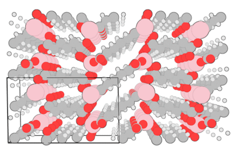

# ascii-phonons

Visualisation of crystal vibrations with Blender.

Visualisation is a powerful tool for the study of vibrations in the solid state.
"Semi-automatic" animations have been generated for scientific publications, where they provide insight to spectroscopic observations.\[[1][Skelton2015],[2][Brivio2015]\] (Images [1](http://dx.doi.org/10.1063/1.4917044.1), [2](http://people.bath.ac.uk/aw558/temp/mapi_phonon.gif).) In order to make this type of imagery more accessible, and add some visual interest to [ajjackson](https://github.com/ajjackson)'s PhD thesis, a more convenient and automatic toolchain is desirable.

A presentation outlining some features and implementation details is [available online](http://ajjackson.github.io/ascii-phonons-slides).

## Features

* Ascii-phonons produces PNG and animated GIF files to illustrate phonon modes.
* The output has an attractive "cartoon-like" visual style with flat colours and outlines.
* A single mode may be visualised, or a tiled array of all modes labelled by frequency.
* Arrows may also be used to indicate the atomic movements; this is vital for static images in printed publications.
* Supercells are used to show the phase difference between neighbouring unit cells. A unit cell bounding box is shown and can be freely translated.
* The camera angle is defined as a Miller index.
* Mass-weighting may optionally be added if this was not done in the .ascii file construction.
* The open-source graphics package Blender is used to render the images; it is also possible to open the Blender scenes for further adjustments before rendering. Experience with Blender is *not* required to use ascii-phonons.
* Ascii-phonons is implemented in Python as a Blender addon and a library for convenient access. A GUI and a command-line interface are provided for easy accessibility and scripting potential. Python programming skills are not required.
* The atomic positions, unit cell and phonon modes are imported from `.ascii` files. These can be generated with [Phonopy](http://phonopy.sourceforge.net). The format was originally specified for [v_sim](http://inac.cea.fr/L_Sim/V_Sim/), a useful program and one of the only tools available for visualising non-Gamma-point phonons.
* User settings can be saved to and loaded from simple config text files. Default parameters including atomic radii, masses and some colours are loaded from editable files in the same format.

## Development

Development is in progress and hosted on [Github](https://github.com/ajjackson/ascii-phonons).
Please use the [issue tracker](https://github.com/ajjackson/ascii-phonons/issues) for feature requests, bug reports and more general questions.
For more information about the structure and goals of this project see the relevant section in the [official documentation](http://ascii-phonons.readthedocs.org/en/latest/Development.html).

## Setup

The simplest way to get up and running is

1. Install [Blender](http://www.blender.org/download) (available in all good package managers).
2. Download the code:
   - either clone the repository with `git clone git@github.com:ajjackson/ascii-phonons`
   - or download the latest version as a [zip file](https://github.com/ajjackson/ascii-phonons/archive/master.zip).

## Requirements

- Some means of generating .ascii files. We like [Phonopy](http://phonopy.sourceforge.net).
- A recent version of [Blender](https://www.blender.org/download); development is currently with Blender 2.76 and later. 
  At least version 2.70 is needed, which provides the wireframe modifier used to draw the bounding box. Note that the versions of Blender available in package managers such as apt-get are often quite dated.
  Installing the latest version for Linux is easy, however; just download the .tar.gz file, untar it and add the directory to your PATH.
- [Imagemagick](http://www.imagemagick.org) tools (specifically "convert" and "montage") are used for image conversion and tiling.
  This is available in most package managers and may even be pre-installed with your Unix-like operating system.
- The GUI uses Tkinter with the python image library. On Linux this is typically packaged as `python-imaging-tk`. Mac OSX and Windows Python distributions tend to include Tkinter, but it may be necessary to also install a PIL implementation such as Pillow.

## Getting started

For those who would prefer to avoid working through the Python API, a command-line wrapper **scripts/ascii-phonons** and a graphical user intergace **scripts/ascii-phonons-gui** are available. Call the script with

    ascii-phonons -h

for information about the numerous command-line arguments, or take a look at the [online documentation](http://ascii-phonons.readthedocs.org/en/latest/CLI.html).

If working on Mac OS X, you may need to specify the path to your Blender binary, which is tucked away in a .app package, using the `-b` flag.
However, the script assumes you have Blender installed in a folder called "Blender" in the root Applications folder, and should find your binary in this case.

A typical call to the wrapper script would be something like:

    ascii-phonons /path/to/my/phonons.ascii -m 5 --static --vectors -o pretty

which should write a static image **pretty.png**, illustrating mode 5 with arrows.
To generate an animation, try

    ascii-phonons /path/to/my/phonons.ascii -m 1 --gif -o pretty

which will use Imagemagick to generate **pretty.gif**.
The `--montage` flag implements the tiled output; try something like

    ascii-phonons /path/to/my/phonons.ascii --static --vectors --montage -o pretty
    
to generate a static image. Note that, while smaller images are rendered, this can take some time if your system has a large number of phonon modes.

When you are comfortable that the code works for you, the GUI (ascii-phonons-gui) offers an easy way to experiment with different settings and features.
The "File" menu of the GUI allows you to save your settings to a .conf file, and to combine your settings with other .conf files including colour schemes.
To use the resulting file with the CLI, use the `--config` flag.

    ascii-phonons /path/to/my/phonons.ascii --config my_amazing.conf
    
Note that information about input and output files is containing within the .conf file, but that **scripts/ascii-phonons** always requires a .ascii file to be provided at the command line.

## Implementation details

The default atomic radii are the covalent radii from [Cordero *et al* (2008)][Cordero2008].
The eigenvectors may be scaled by the square root of the relative atomic mass; the atomic mass data is from [Coursey *et al.* (2015)][Coursey2015].
(This is usually unnecessary as Phonopy applies this scaling when generating the .ascii file.)

## Acknowledgements

Work on this package began while [ajjackon](https://github.com/ajjackson) was a PhD student funded by [EPSRC](https://www.epsrc.ac.uk/) through the [Center for Sustainable Chemical Technologies](http://www.bath.ac.uk/csct) (grant no. [EP/G03768X/1](http://gow.epsrc.ac.uk/NGBOViewGrant.aspx?GrantRef=EP/G03768X/1)) at the University of Bath.
Further work to fix bugs and improve the documentation and useability has taken place as a Research Assistant the same [research group](https://wmd-group.github.io), while funded by the [ERC](https://erc.europa.eu) ([project 277757](http://cordis.europa.eu/project/rcn/100807_en.html)).

## License

GNU GPL v3

## Disclaimer

Use at your own risk. This project is not affiliated with Blender, Phonopy or v_sim.

[Skelton2015]: http://dx.doi.org/10.1063/1.4917044 "Jonathan M. Skelton, Adam J. Jackson, Mirjana Dimitrievska, Suzanne K. Wallace and Aton Walsh (2015), *APL Mat.* **3**, 041102"
[Brivio2015]: http://dx.doi.org/10.1103/PhysRevB.92.144308 "Federico Brivio, Jarvist M. Frost, Jonathan M. Skelton, Adam J. Jackson, Oliver J. Weber, Mark T. Weller, Alejandro R. Goñi, Aurélien M. A. Leguy, Piers R. F. Barnes, and Aron Walsh (2015), *Phys. Rev. B* **92**, 144308"
[Cordero2008]: http://dx.doi.org/10.1039/B801115J "Beatriz Cordero, Verónica Gómez, Ana E. Platero-Prats, Marc Revés, Jorge Echeverría, Eduard Cremades, Flavia Barragána and Santiago Alvarez (2008), *Dalton Trans.* 2832-2838"
[Coursey2015]: http://physics.nist.gov/Comp "Coursey, J.S., Schwab, D.J., Tsai, J.J., and Dragoset, R.A. (2015), Atomic Weights and Isotopic Compositions (version 4.1). [Online] Available: http://physics.nist.gov/Comp [2015-10-25]. National Institute of Standards and Technology, Gaithersburg, MD."
