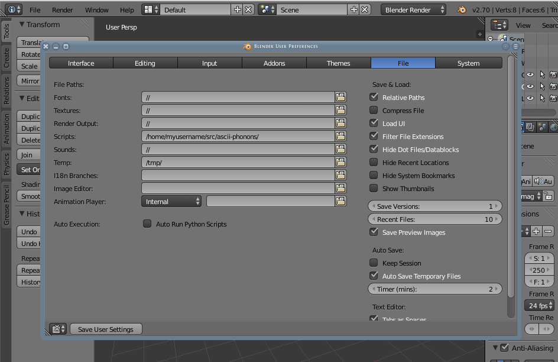

# ascii-phonons

Visualisation of crystal vibrations with Blender.

Visualisation is a powerful tool for the study of vibrations in the solid state.
"Semi-automatic" animations have been generated for scientific publications, where they provide insight to spectroscopic observations.\[[1][Skelton2015],[2][Brivio2015]\] (Images [1](http://dx.doi.org/10.1063/1.4917044.1), [2](http://people.bath.ac.uk/aw558/temp/mapi_phonon.gif).) In order to make this type of imagery more accessible, and add some visual interest to [ajjackson](https://github.com/ajjackson)'s PhD thesis, a more convenient and automatic toolchain is desirable.

## Development

This is still very rough and ready. "Old code" is some legacy code from the "semi-automatic" process. This code depends on [Clemens Barth's XYZ file importer](http://development.root-1.de/Atomic_Blender_XYZ.php).

The target for input files is the ASCII format used by [v_sim](http://inac.cea.fr/L_Sim/V_Sim/), a useful program and currently one of the only tools available for visualising phonons. These files contain all the information needed to define a crystal sructure and its vibrations. It is presumed that these are generated by [Phonopy](http://phonopy.sourceforge.net/) from *ab initio* electronic structure calculations, and initially this code will only target the features used by Phonopy. Extension to the full ASCII format is of course welcome.
Animation and rendering will be done in [Blender](http://www.blender.org/).
The preferred approach to Blender is to write an "add-on" which carries out importing duties.

Developing Blender add-ons can be a bit clunky as one is required to
mess around with the GUI when testing changes, so there may be some
hackery to get around this.  Building Blender as a Python library
would ease development considerably, but appears to be quite difficult
to do on a Mac.

The target platforms are modern GNU/Linux distributions and Mac OS X. Windows support is seen as faintly desirable, but would impede the initial development process.

## Setup

The simplest way to set up this code at the moment is

1. Download the code with `git clone git@github.com:ajjackson/ascii-phonons`
2. Setup pyyaml for Blender's python3
    - On a Debian or Ubuntu system with sudo privileges, just `apt-get install python3-yaml`.
    - Otherwise, get pyyaml from http://pyyaml.org and create a simlink to the modules directory in this code with `ln -s /path/to/pyyaml/lib3/yaml /path/to/ascii-phonons/modules/`
3. Open Blender and, in the default file, add the project folder to Blender's python path in the User Preferences. Remember to "save user settings" with the button at the bottom of the panel, before saving the new defaults with CTRL-U.

4. Close Blender; the path is updated when Blender is re-opened.

## Using the wrapper script

At the moment the most sane way to work with this is to use the wrapper **Scripts/blend_ascii.py** in a Bash shell. Call the script with

    python blend_ascii.py -h

for information about the numerous command-line arguments.
If working on Mac OS X, you will probably need to specify the path to your Blender binary, which is tucked away in a .app package.
A typical call to the wrapper script on a Mac would therefore be something like:

    python blend_ascii.py /path/to/my/phonons.ascii -b /Applications/Blender/Blender.app/Contents/MacOS/blender --static --vectors

## Requirements

- Some means of generating .ascii files. We like [Phonopy](http://phonopy.sourceforge.net).
- A recent version of Blender; development is currently with
  Blender 2.73 and later, although some effort exists to preserve compatibility with earlier versions.
  [Ubuntu repositories are often quite far behind...]
- A Python 3-compatible and Blender-accesible version of pyyaml.

## License

GNU GPL v3

## Disclaimer

Use at your own risk. This project is not affiliated with Blender, Phonopy or v_sim.

[Skelton2015]: http://dx.doi.org/10.1063/1.4917044
[Brivio2015]: http://arxiv.org/abs/1504.07508
