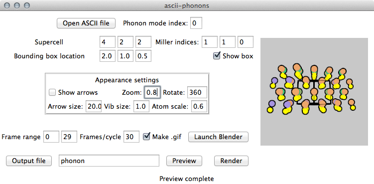

.. _gui:

Graphical user interface
========================

A simple graphical user interface (GUI) is available, including a "preview" window.
At this time a useful subset of features is implemented.
User configuration files can be saved and loaded using the File menu.
As shown below, on Mac OSX this is located at the top of the screen;
on other Unix-like systems and Windows the menu is part of the floating GUI window.
When a config file is loaded with "Read config", it is combined with the existing configuration
so, for example, the user can  a new colour scheme over an existing set of colour parameters.
If this behaviour is not desired, use "Reset config" before "Read config".

To launch the GUI, which is compatible with Python 3 and Python 2.7, simply run **scripts/ascii-phonons-gui**.

Dependencies
------------

- Tkinter is used to draw the GUI. This is included in standard Python distributions.

- The "PIL" module is loaded to handle the preview rendering. This dependency is best satisfied by installing "Pillow". On Linux, the tk imaging part of this is often packaged separately, with names like `python-imaging-tk`.
